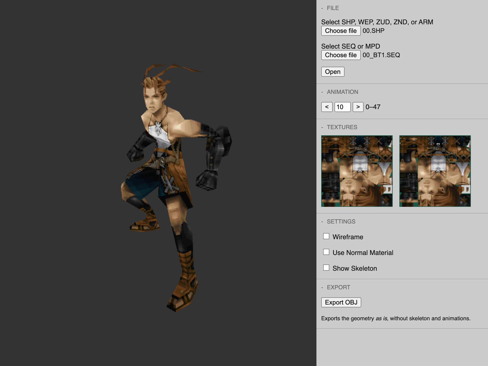
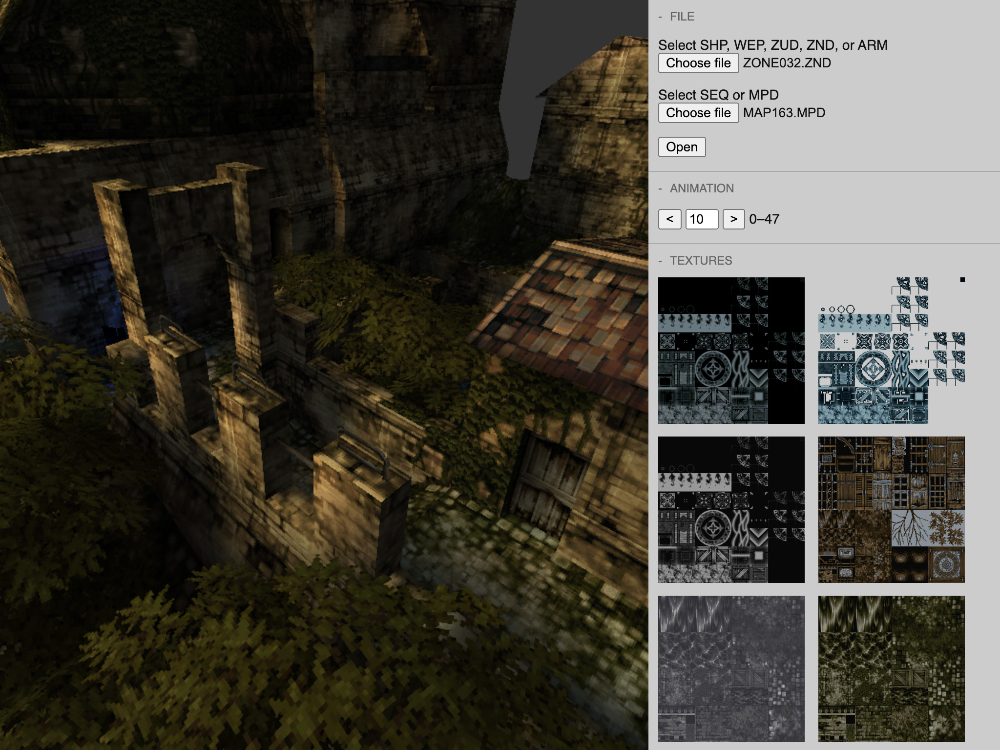

# Vagrant Story Tools

A toolset for Vagrant Story (2000, Square), written in JavaScript with Three.js.
Contains a mostly working model viewer.

[Run in Browser](https://morris.github.io/vstools)

## [Run in Browser](https://morris.github.io/vstools)

Runs in browsers supporting WebGL, like Firefox.
The viewer opens individual files obtained from a CD image
which have to be extracted first from your copy of Vagrant Story.

The toolset is developed for the US Version of Vagrant Story but should work with any.

## Supported File Types

- WEP (weapons)
- SHP (characters)
- SEQ (animations)
- ZUD (basically SHP + SEQ + WEP)
- ZND (zone data)
- MPD (map)
- ARM (minimap)

To open an MPD file, you'll need the correct ZND file.
You can find the Zone/Map list
[here](http://datacrystal.romhacking.net/wiki/Vagrant_Story:rooms_list).

## Motivation

Reverse engineering is very rewarding.
You get to know assembly, debuggers, system architecture, hacking live programs and much more.
Making sense of undocumented file formats is great, kind of archeological fun.

Vagrant Story itself is a unique piece of art,
featuring an outstanding character and level design.

## Contributions and Acknowledgments

- Tremendous work in deciphering Vagrant Story by [Michael Collins](https://github.com/collinsmichael)
- WEP textures fixed by [Oliver Barraza](https://github.com/MercurialForge)

A lot of information on Vagrant Story hacking can be found here:
http://datacrystal.romhacking.net/wiki/Vagrant_Story

A prior version was written in Java, which can be found [here](https://github.com/morris/vstools-java).
